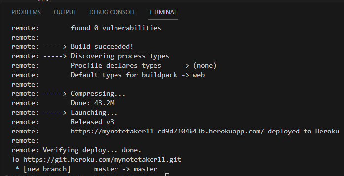
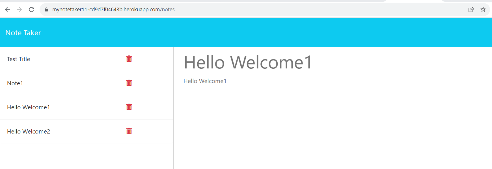

# MyNoteTaker1.1
  [](https://opensource.org/licenses/MIT)
 ## Description
  Notemaker is a simple note-taking application built using Node.js, Express, and JSON to store and manage notes. It allows users to create, view, and delete notes through a user-friendly web interface.
  ## Table of Contents
  - [Installation](#installation)
  - [Usage](#usage)
  - [License](#license)
  - [Deployed Link](#deployed-link)
  - [Sample Application](#sample-application)
  - [Questions](#questions)
  ## Installation <a name="installation"></a>

  To deploy your Note Taker application on Heroku, you'll need to follow these installation instructions:

1. Install Heroku CLI:
   - If you haven't already, go to the Heroku website (https://www.heroku.com/) and sign up for a free Heroku account.
   - Download and install the Heroku CLI for your operating system: https://devcenter.heroku.com/articles/heroku-cli

2. Prepare the project:
   - Make sure your Note Taker application is working locally with all the required functionalities (GET, POST, DELETE, etc.).
   - Ensure you have a `package.json` file in the root of your project, which includes the necessary dependencies and scripts.

3. Configure the start script:
   - In your `package.json`, make sure you have a "start" script that runs your `app.js` file or the main server file.
   - For example, in your `package.json`:

```json
"scripts": {
  "start": "node app.js"
},
```

4. Create a `.gitignore` file (if you haven't already) to ignore `node_modules`, so you don't push them to Heroku:

```
node_modules
```

5. Initialize a Git repository:
   - If you haven't already, navigate to your project folder and run the following commands to initialize a Git repository and commit your code:

```bash
git init
git add .
git commit -m "Initial commit"
```

6. Login to Heroku:
   - Open your terminal or command prompt and run `heroku login` to log in to your Heroku account.

7. Create a Heroku app:
   - Run the following command to create a new Heroku app:

```bash
heroku create your-app-name
```

   - Replace `your-app-name` with the desired name for your Heroku app. This command will also add a remote named `heroku` to your Git repository.

8. Deploy the app:
   - To deploy your application to Heroku, run:

```bash
git push heroku master
```

   - This command will push your code to Heroku, and Heroku will automatically build and deploy your application.

9. Ensure the app is running:
   - After the deployment process is complete, run:

```bash
heroku ps:scale web=1
```

   - This command will ensure that at least one instance of the app is running.

10. Open the app in your browser:
    - To open your deployed app in your browser, run:

```bash
heroku open
```

Congratulations! Your Note Taker application is now deployed on Heroku and accessible through the provided URL. Remember that Heroku assigns a random URL to your app by default, but you can set a custom domain if needed. Additionally, the application will now use the environment variable `process.env.PORT` provided by Heroku for the port number, so you don't need to specify a port manually.

If you make changes to your app, simply commit your code, and then use `git push heroku master` to deploy the updated version to Heroku.


### Sample Deployment 

[]

  
  ## Usage <a name="usage"></a>
  
  Sure! Here is the usage information for the Note Taker application:

1. Landing Page:
   - When you open the Note Taker application, you will be presented with a landing page with a link to the notes page.

2. Notes Page:
   - Clicking on the link to the notes page will take you to the notes page, where you can manage your notes.

3. Existing Notes List:
   - On the notes page, you will see a left-hand column that displays a list of your existing notes. Each note is represented by its title.
   - To view the details of a specific note, click on the title of the note in the left-hand column.

4. Create a New Note:
   - On the notes page, you will find an empty form on the right-hand column to create a new note.
   - Enter the title and text of the new note in the input fields provided.
   - After entering the note details, a Save icon will appear in the navigation bar.
   - Click the Save icon to save the new note. The note will be added to the list of existing notes on the left-hand column.

5. Delete a Note:
   - To delete an existing note, locate the note in the left-hand column and click the associated Delete icon.
   - Confirm the deletion when prompted. The note will be removed from the list of existing notes.

6. Edit an Existing Note:
   - To edit an existing note, click on the title of the note in the left-hand column to display its details in the right-hand column.
   - Update the note's title and text in the input fields.
   - Click the Save icon to save the changes to the note.

7. Application Persistence:
   - The Note Taker application persists your notes even after closing and reopening the application.
   - The notes are stored in a `db.json` file on the server, allowing you to retrieve and manage them across sessions.

8. Deployment (Heroku):
   - The application can be deployed on Heroku to make it accessible on the web. Follow the provided installation instructions to deploy the app on Heroku.
  
   
  ## License <a name="license"></a>
  This project is licensed under the MIT license.
  https://opensource.org/licenses/MIT
  
  ## Deployed Link <a name="deployed-link"></a>
  https://mynotetaker11-cd9d7f04643b.herokuapp.com/
  
  ## Sample Application <a name="sample-application"></a>
  
  []
  
  ## Questions <a name="questions"></a>
  If you have any questions, please contact me at arun@arun.com. 
  
  My GitHub profile is [arundvp](https://github.com/arundvp).

